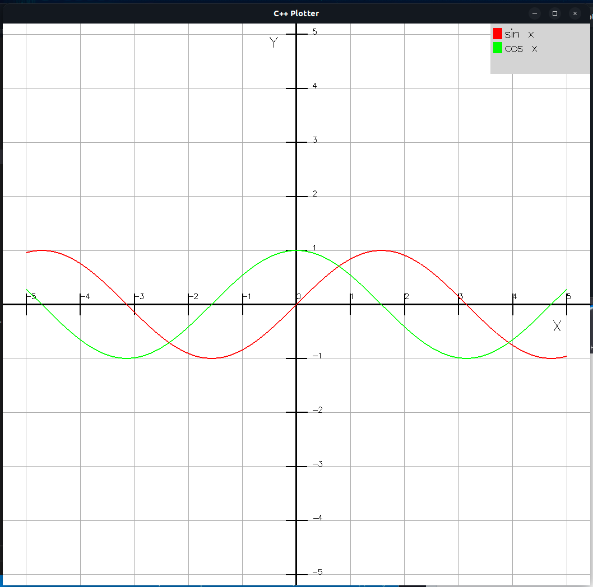

# SIMFOR_plotter_c

SIMFOR_plotter_c - модуль графического вывода для системы математического моделирования на языке программирования C++.




Библиотека разрабатывалась и тестировалась под операционной системой Ubuntu 22.04.4 LTS. Компилятор g++ 11.4.0. Make 4.3.

Модуль состоит из заголовочного файла plotter.h, файла реализации plotter.cpp. Приведены тестовые примеры и Makefile для сборки библиотеки и примеров.

## Особенности
* Работа с 2D и 3D графиками;
* Отображение нескольких графиков в одном окне;
* Настройки отображения (размер окна; текст осей, легенды; цвет, стиль графиков);
* Управление камерой с помощью клавиатуры (масштабирование, перемещение, поворот).

## Установка
1. Установите требуемые зависимости:
```
sudo apt-get update
```
```
sudo apt-get install freeglut3 freeglut3-dev
```
```
sudo apt-get install make
```
```
sudo apt-get install g++
```
2. Клонируйте репозиторий:
```
git clone https://github.com/vadimts0y/SIMFOR_plotter_c.git
```
3. Перейдите в каталог SIMFOR_plotter_c:
```
cd SIMFOR_plotter_c
```
4. Соберите библиотеку и тесты:
```
make
```
или сборка статической библиотеки:
```
g++ -c plotter.cpp -o plotter.o
```
```
ar rcs libplotter.a plotter.o
```
Компиляция вашей программы test:
```
g++ test.cpp -o test -L. -lplotter -lGL -lglut
```

Makefile собирает статическую библиотеку libplotter.a и примеры test_2d, test_3d, test_points.

**Управление (зависит от раскладки и регистра)**
* "o" - циклический выбор отображаемого графика;
* "i" - вкл/выкл показа всех графиков;
* "g" - циклическая смена режима отображения графиков:
Для графика: линия -> точка -> точки и линии;
Для поверхности: точки-> линии с точками -> линии -> заливка с слабозаметными линиями;

* "x","y","z" - поворот вокруг соответсвующей оси;
* "X","Y","Z" - поворот в обратную сторону;

* "w","s" - перемещение по оси У;
* "a","d" - перемещение по оси X;
* "q","e" - перемещение по оси Z;

* "l" - показать легенду;

* "n" - сетка;
* "m" - миллиметровый режим.

## Внесение вклада
Если у вас есть идеи для улучшения, новых функций или исправления ошибок, не стесняйтесь создавать issues и отправлять pull request.

## Лицензия
Библиотека распространяется под лицензией MIT. См. файл LICENSE для подробностей.

## Авторы
Цой Вадим Олегович.

## Благодарности
Отдельное спасибо научному руководителю Алексееву Евгению Ростиславовичу.

## Поддержка
По любым вопросам, пожалуйста, свяжитесь по почте vadim086.90@mail.ru.

## Отказ от ответственности
Библиотека предоставляется без каких-либо гарантий. Используйте на свой страх и риск.


